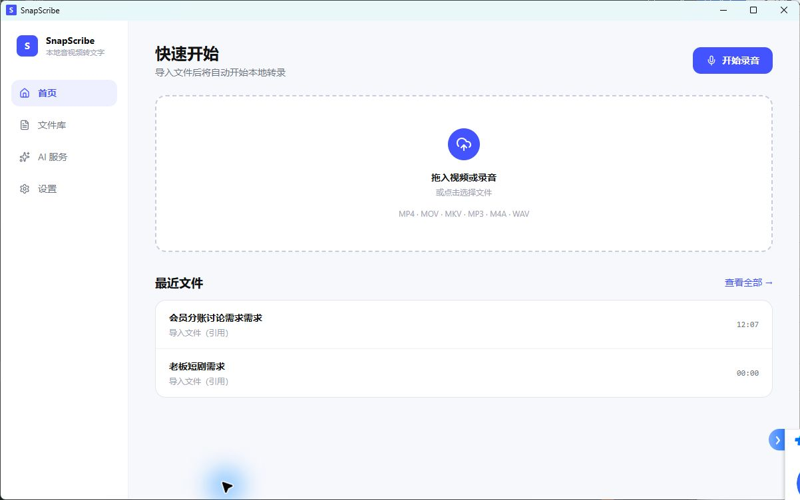
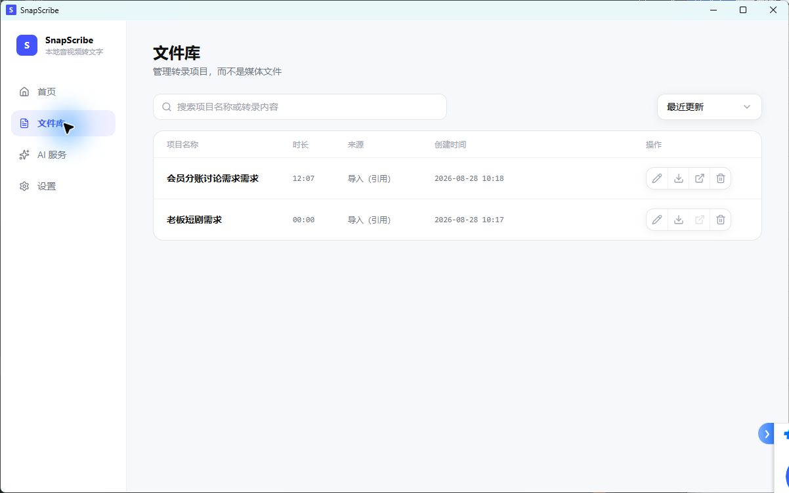
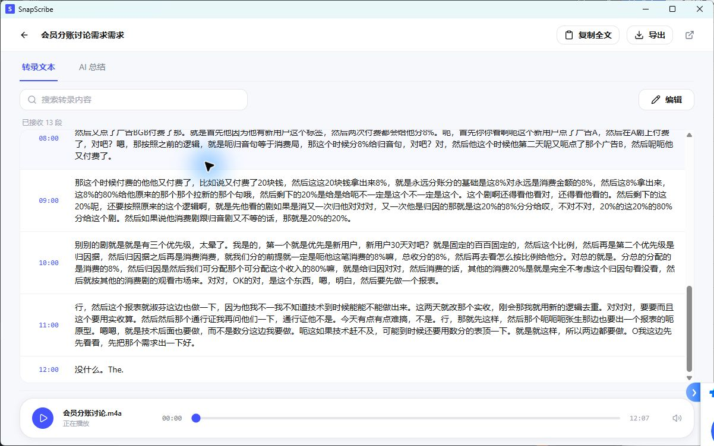
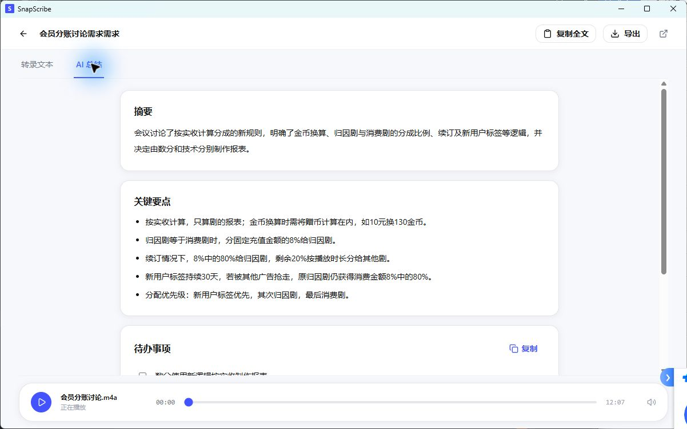
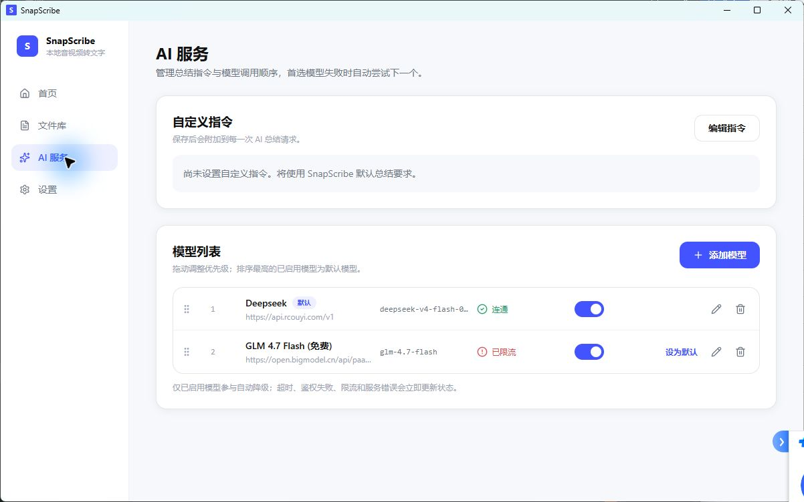
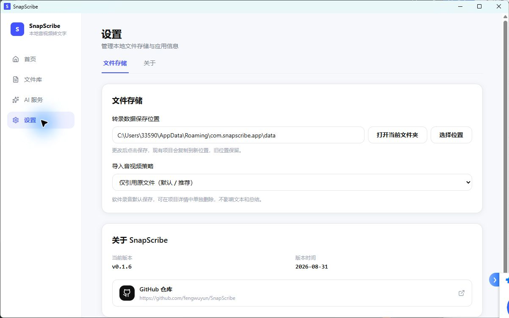

# SnapScribe v0.1.6 需求文档与功能清单

> 文档版本：1.0  
> 对应应用版本：SnapScribe v0.1.6  
> 整理日期：2026-08-31  
> GitHub：[fengwuyun/SnapScribe](https://github.com/fengwuyun/SnapScribe)  
> Release：[SnapScribe v0.1.6](https://github.com/fengwuyun/SnapScribe/releases/tag/v0.1.6)

## 1. 产品定位

SnapScribe 是面向 Windows 桌面的本地音视频、录音转文字工具，核心价值是：

- **简单：** 导入文件后直接开始转录，不增加确认步骤。
- **快速：** 首页聚焦文件导入和录音，尽量缩短从输入到文本的操作路径。
- **本地：** 音视频、转录文本、AI 总结和模型密钥均以本地存储为主。
- **可恢复：** 原媒体丢失时仍可查看文本和总结，并可重新关联原始文件。
- **可扩展：** AI 总结支持多个 OpenAI Compatible 模型，并按顺序自动故障转移。

## 2. 产品原则

1. 一级入口只承载高频核心能力，不增加 Dashboard、Tips、标签、收藏等复杂模块。
2. 导入文件后自动创建转录项目并开始转录。
3. 用户导入的媒体默认仅引用原路径，减少磁盘占用。
4. 转录项目是文件库的管理对象，媒体文件只是项目的一部分。
5. 文本与 AI 总结独立于原媒体保存；原媒体不可用不影响内容查看。
6. 设置必须点击“保存设置”后生效，不自动保存。
7. 操作反馈遵循：即时响应、不跳不闪、操作连续、状态清楚、动效克制。

## 3. 信息架构

当前版本包含四个一级页面：

| 一级页面 | 主要职责 |
| --- | --- |
| 首页 | 导入音视频、开始录音、查看最近项目 |
| 文件库 | 搜索、排序和管理全部转录项目 |
| AI 服务 | 管理自定义指令、AI 模型、默认顺序和连接状态 |
| 设置 | 管理文件存储、导入策略和应用信息 |

文件详情为项目内二级页面，包含“转录文本”和“AI 总结”两个页签。

## 4. 核心业务流程

### 4.1 导入并转录

```text
拖入文件 / 点击选择文件
  → 按当前导入策略创建转录项目
  → 自动开始本地转录
  → 显示切片进度和已返回文本
  → 用户可暂停、继续或取消
  → 保存带时间戳的转录文本
  → 在文件详情中查看、编辑、搜索、复制和导出
```

### 4.2 录音与近实时字幕

```text
点击开始录音
  → 首页切换为录音状态
  → 显示录音时长、动态波形和状态
  → 每 15 秒形成一个本地录音切片并转录
  → 持续追加近实时字幕
  → 支持暂停、继续、结束和取消
  → 结束后进入文件详情
```

### 4.3 AI 总结

```text
打开项目的 AI 总结页签
  → 若没有模型，跳转 AI 服务模型列表
  → 按列表顺序尝试已启用且配置完整的模型
  → 当前模型失败时自动尝试下一个
  → 成功后保存摘要、关键要点和待办事项
```

## 5. 页面需求与实际截图

> 以下截图来自本机运行的 SnapScribe v0.1.6。截图包含本机示例项目和转录内容；若文档需要公开发布，建议先替换为专用演示数据。

### 5.1 首页



#### 页面要求

- 提供大面积拖拽上传区，并支持点击选择文件。
- 支持 MP4、MOV、MKV、MP3、M4A、WAV。
- 导入后自动开始转录，不增加确认步骤。
- 右上角提供“开始录音”。
- 展示最近转录项目，点击直接进入详情。
- 项目名称列表显示最多 10 个字符，超出部分省略。
- 录音时主区域切换为录音面板，显示时长、波形、字幕和操作状态。

### 5.2 文件库



#### 页面要求

- 管理“转录项目”，而不是单纯管理媒体文件。
- 支持按项目名称或转录内容搜索。
- 搜索结果中的命中词使用主题紫色高亮。
- 支持最近更新、创建时间、名称、时长排序。
- 列表显示项目名称、时长、来源、创建时间和操作。
- 支持打开、重命名、删除、导出、打开原文件位置。
- 删除项目前必须二次确认。
- 排序按钮和下拉菜单宽度、圆角、选中态与整体 UI 保持一致。
- 默认窗口宽度下不出现横向滚动条。

### 5.3 文件详情——转录文本



#### 页面要求

- 转录文本按时间戳分段显示，并允许纵向滚动。
- 单击时间戳或文本段，在没有选区时跳转到对应媒体位置。
- 双击文本段复制整段文字；拖选部分文字后支持 `Ctrl+C` 和右键复制。
- 支持搜索、直接编辑、复制全文和导出。
- 文本直接原地编辑，保存后保留时间戳结构。
- 底部播放器常驻，支持播放、暂停、拖动进度和音量。
- 原媒体不可用时显示提示，并提供“重新关联原始文件”。
- 用户可以单独删除 SnapScribe 录音媒体，不影响文本和总结。

### 5.4 文件详情——AI 总结



#### 页面要求

- 默认输出三个固定模块：摘要、关键要点、待办事项。
- AI 总结根据当前转录文本生成，并记录对应的转录修订版本。
- 摘要、关键要点和待办文字均可拖选复制。
- “复制全文”和“导出”根据当前页签决定内容：
  - 转录文本页签复制或导出转录文本。
  - AI 总结页签复制或导出总结文本。
  - AI 总结导出文件名增加“AI总结”后缀。
- 待办事项支持新增、删除、原地编辑、失焦自动保存和完成标记。
- 已完成待办显示删除线和弱化颜色。
- 待办卡片右上角提供“复制”，一次复制全部待办并保留完成状态标识。

### 5.5 AI 服务



#### 页面要求

- AI 服务作为一级页面，与设置同级。
- 服务协议统一为 OpenAI Compatible，允许连接官方 API、第三方代理和本地服务。
- 自定义指令会附加到每次 AI 总结请求。
- 支持添加、编辑、删除、启用和停用模型。
- 模型支持拖动排序。
- 支持“设为默认”，点击后自动启用并立即置顶。
- 排序最高的已启用模型显示“默认”。
- 默认模型失败后，按当前顺序依次尝试其他已启用模型，成功即停止。
- 超时、鉴权失败、限流和服务端错误需要立即更新模型状态。
- 已测试连通的模型保存配置后重新确认连接，成功显示绿色“连通”。
- 已保存的 API Key 输入框只显示 `******`，不读取或暴露真实密钥；用户开始输入时再替换。

#### GLM 4.7 Flash 预设

系统为新老用户自动加入以下模型预设：

```json
{
  "presetKey": "glm-4.7-flash",
  "name": "GLM 4.7 Flash (免费)",
  "protocol": "openai-chat",
  "baseUrl": "https://open.bigmodel.cn/api/paas/v4",
  "modelId": "glm-4.7-flash",
  "authType": "bearer",
  "endpointMode": "auto",
  "timeoutSecs": 60
}
```

- 用户只需填写智谱 API Key。
- 未填写 Key 时显示“待配置”，并跳过该模型，不阻断后续模型。
- 测试成功后显示绿色“连通”。
- 预设只自动加入一次，不覆盖已有密钥或用户排序。

### 5.6 设置



#### 文件存储

- 设置转录数据保存位置。
- 提供“打开当前文件夹”，打开当前已保存并生效的数据根目录。
- 提供三种导入策略：

| 策略 | 行为 |
| --- | --- |
| 仅引用原文件 | 默认、推荐；只保存原始路径，不复制媒体 |
| 复制到 SnapScribe | 保留原文件，同时在项目目录保存一份媒体 |
| 移动到 SnapScribe | 成功导入后删除原位置文件，SnapScribe 内只保留一份 |

- 软件录音默认保存，用户可在项目详情中单独删除录音媒体。
- 更改必须点击“保存设置”后生效。

#### 关于

- 显示当前版本和版本时间。
- 显示 GitHub 仓库入口，点击使用系统浏览器打开。
- 不包含开机自启等与核心定位无关的设置。

## 6. 功能清单

| 模块 | 功能 | 关键行为 | v0.1.6 状态 |
| --- | --- | --- | --- |
| 首页 | 拖拽导入 | 支持拖入或点击选择文件 | 已实现 |
| 首页 | 自动转录 | 导入成功后自动开始 | 已实现 |
| 首页 | 最近文件 | 展示最近项目并快速打开 | 已实现 |
| 录音 | 本地录音 | 保存完整录音文件 | 已实现 |
| 录音 | 近实时字幕 | 15 秒切片，持续返回文字 | 已实现，需设备手工验收 |
| 录音 | 波形与计时 | 显示动态波形、录音时长和状态 | 已实现，需设备手工验收 |
| 录音 | 暂停/继续/取消 | 操作连续并清楚显示状态 | 已实现，需设备手工验收 |
| 转录 | 分段进度 | 显示总进度、当前切片和已接收文本 | 已实现 |
| 转录 | 暂停/继续/取消 | 转录过程可随时控制 | 已实现 |
| 文件库 | 搜索 | 按名称和转录内容搜索 | 已实现 |
| 文件库 | 搜索高亮 | 命中词主题紫色高亮 | 已实现 |
| 文件库 | 排序 | 最近更新、创建时间、名称、时长 | 已实现 |
| 文件库 | 项目操作 | 打开、重命名、删除、导出、打开原位置 | 已实现 |
| 文件库 | 删除确认 | 删除项目前二次确认 | 已实现 |
| 转录文本 | 时间戳跳转 | 单击段落跳转媒体位置 | 已实现 |
| 转录文本 | 编辑 | 原地编辑并保存 | 已实现 |
| 转录文本 | 搜索 | 搜索转录内容 | 已实现 |
| 转录文本 | 复制 | 拖选、快捷键、右键、双击整段 | 已实现，右键需系统手工验收 |
| 转录文本 | 导出 | 导出当前转录文本 | 已实现 |
| 播放器 | 媒体播放 | 播放、暂停、进度和音量 | 已实现 |
| 媒体 | 重新关联 | 原媒体失效后选择新路径 | 已实现 |
| 媒体 | 单独删除 | 删除媒体但保留文本和总结 | 已实现 |
| AI 总结 | 内容生成 | 摘要、关键要点、待办事项 | 已实现 |
| AI 总结 | 复制/导出 | 按当前页签复制和导出 | 已实现 |
| 待办 | 新增/删除/编辑 | 直接编辑，失焦自动保存 | 已实现 |
| 待办 | 完成状态 | 勾选完成并显示删除线 | 已实现 |
| 待办 | 整体复制 | 一次复制全部待办 | 已实现 |
| AI 服务 | 自定义指令 | 附加到每次 AI 请求 | 已实现 |
| AI 服务 | 多模型 | 添加、编辑、删除、启停 | 已实现 |
| AI 服务 | 拖动排序 | 调整模型调用优先级 | 已实现 |
| AI 服务 | 设为默认 | 自动启用、置顶并显示默认标签 | 已实现 |
| AI 服务 | 自动故障转移 | 失败后按顺序尝试下一个模型 | 已实现 |
| AI 服务 | 状态更新 | 连通、超时、鉴权、限流、服务错误 | 已实现 |
| AI 服务 | 密钥保护 | DPAPI 本机加密，前端只显示遮罩 | 已实现 |
| 设置 | 数据目录 | 选择、保存并打开当前目录 | 已实现 |
| 设置 | 三种导入策略 | 引用、复制、移动 | 已实现 |
| 关于 | 版本信息 | 版本号、时间、GitHub 链接 | 已实现 |

## 7. 数据与文件存储规则

### 7.1 项目数据

每个转录项目使用独立目录，保存项目元数据、转录文本和可选 AI 总结：

```text
<dataRoot>/
└─ projects/
   └─ <projectId>/
      ├─ project.json
      ├─ transcript.json
      ├─ summary.json          可选
      └─ <media-file>          复制、移动或软件录音时存在
```

### 7.2 媒体生命周期

- **引用：** 只保存原文件路径。原文件移动或删除后失去播放能力，但文本和总结继续可用。
- **复制：** 原位置和项目目录各保留一份。
- **移动：** 先复制并校验目标文件，项目提交成功后再删除源文件。
- **软件录音：** 默认保存在项目目录中，可独立删除。
- **重新关联：** 更新媒体引用，不改写既有文本和 AI 总结。

### 7.3 文本与总结

- 转录文本保存为带修订号的结构化 JSON。
- AI 总结保存其来源转录修订号，避免误认为旧总结对应最新文本。
- 待办使用稳定 ID、文字和完成状态保存。
- 文本和总结不依赖媒体文件存在。

### 7.4 API Key

- API Key 使用 Windows DPAPI 在本机加密保存。
- 配置 JSON、日志、错误信息和导出文件不得包含真实密钥。
- 前端读取模型配置时只能获得 `hasApiKey` 状态，不能读取真实 Key。

## 8. AI 请求与故障转移规则

1. 只选择已启用且配置完整的模型。
2. 按用户当前排序从上到下请求。
3. 首个成功响应结束本次请求。
4. 超时、鉴权失败、限流、服务端错误和无效响应分别记录状态。
5. 当前模型失败后继续尝试下一个模型。
6. 所有模型失败时，向用户汇总可读错误，不覆盖已有总结。
7. 自定义指令附加到每次请求，但不能替代生成摘要、关键要点和待办事项的固定结构要求。

## 9. 视觉与交互规范

- 浅色桌面 UI，白色和浅灰背景。
- 蓝紫色为主色，成功使用绿色，错误使用红色，警告使用橙色。
- 使用圆角卡片和适中的信息密度。
- 状态变化优先使用内联提示、颜色、图标和轻量动画。
- 不因操作造成页面整体跳动或闪烁。
- 危险操作提供二次确认；普通高频操作不增加额外确认。
- 主操作路径尽量保持在一个页面内完成。
- 默认窗口为 1200 × 720，最小尺寸为 1180 × 560。

## 10. 明确不做的功能

- 标签、文件夹、收藏和复杂知识库管理。
- AI 总结独立一级页面。
- 待办负责人、截止时间、优先级、提醒和跨端同步。
- 用户账号、云端媒体存储和云端项目同步。
- 开机自启及与核心转录流程无关的系统设置。
- 自动移动已有历史项目的外部媒体。

## 11. 验收清单

### 11.1 核心链路

- [ ] 导入支持格式文件后自动开始转录。
- [ ] 转录过程正确显示进度、切片和已返回文本。
- [ ] 暂停、继续、取消操作状态清楚且不会丢失已完成文本。
- [ ] 录音每 15 秒追加一批近实时字幕。
- [ ] 转录完成后可以查看、编辑、搜索、复制和导出文本。
- [ ] 点击文本段可跳转到播放器对应时间。

### 11.2 存储

- [ ] 引用策略不复制媒体。
- [ ] 复制策略保留原媒体并创建项目副本。
- [ ] 移动策略成功后原位置文件消失，项目中只保留一份。
- [ ] 移动失败不会丢失源文件。
- [ ] 媒体失效后文本与总结仍可查看。
- [ ] 重新关联后恢复播放。

### 11.3 AI

- [ ] 没有模型时，从 AI 总结跳转到 AI 服务模型列表。
- [ ] 模型可拖动并可设为默认。
- [ ] 默认模型立即置顶并显示“默认”。
- [ ] 默认模型失败后自动尝试下一个模型。
- [ ] 已连通模型保存后仍显示绿色“连通”。
- [ ] API Key 在界面只显示 `******`。
- [ ] AI 总结只生成摘要、关键要点和待办事项。

### 11.4 待办和复制

- [ ] 待办支持新增、删除、直接编辑和失焦保存。
- [ ] 待办完成后显示删除线，重启后状态保持。
- [ ] 待办卡片“复制”可以复制全部待办。
- [ ] 转录文本支持拖选、`Ctrl+C`、右键复制和双击整段复制。
- [ ] 当前页签的复制和导出内容正确。

## 12. 版本与发布信息

| 项目 | 内容 |
| --- | --- |
| 当前版本 | 0.1.6 |
| 版本时间 | 2026-08-31 |
| Git 标签 | `v0.1.6` |
| 主分支提交 | `ed6f41dc4e0ba7d3a015fd026fbb780f015033b6` |
| Windows 安装包 | `SnapScribe_0.1.6_x64-setup.exe` |
| 安装包 SHA-256 | `BC10A5A57947BD45E49A818F84D5C6C276CF02484097ACAA6A000E655C45782A` |
